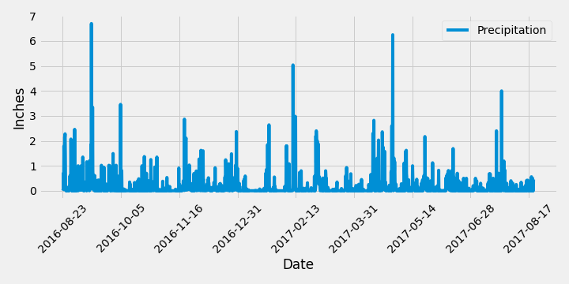
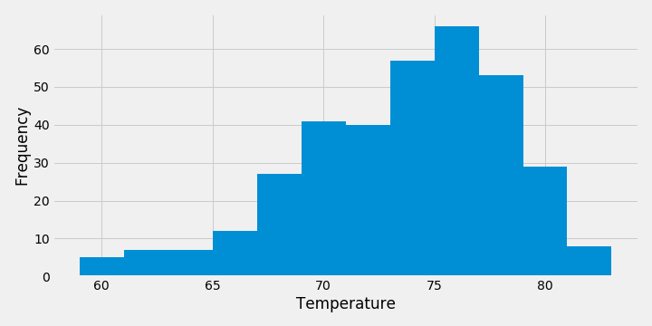

# sqlalchemy-challenge

Starting with a `jupyter notebook` I analyzed the data using SQLAlchemy to find the following:
1. Precipitation data from the last year within the dataset

2. Temperature data from the last year for the most active station

Next, the same dataset was used to design a Flask API in `app.py` based on the queries from the jupyter notebook